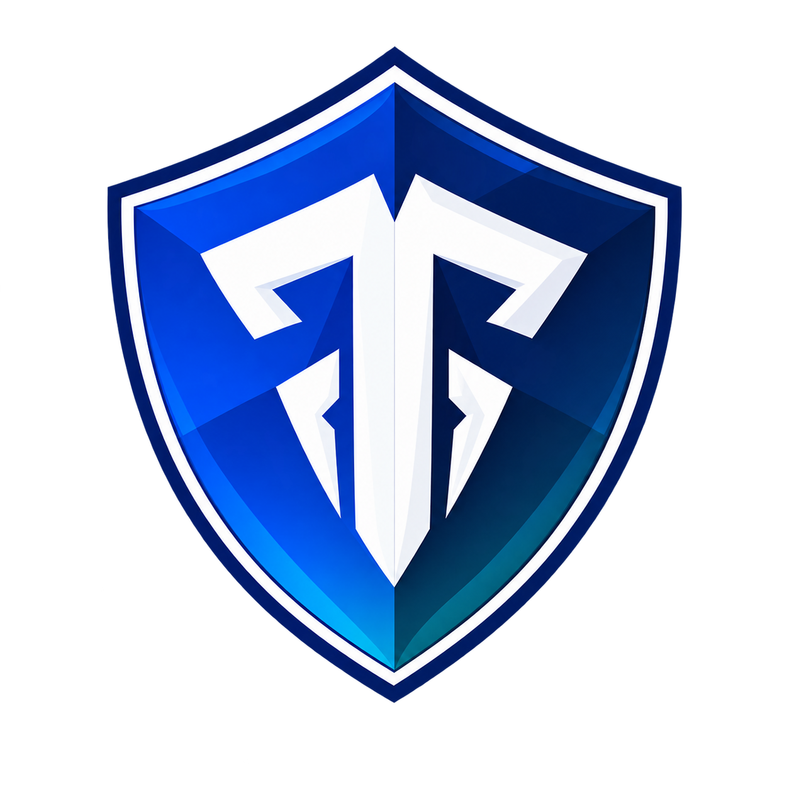
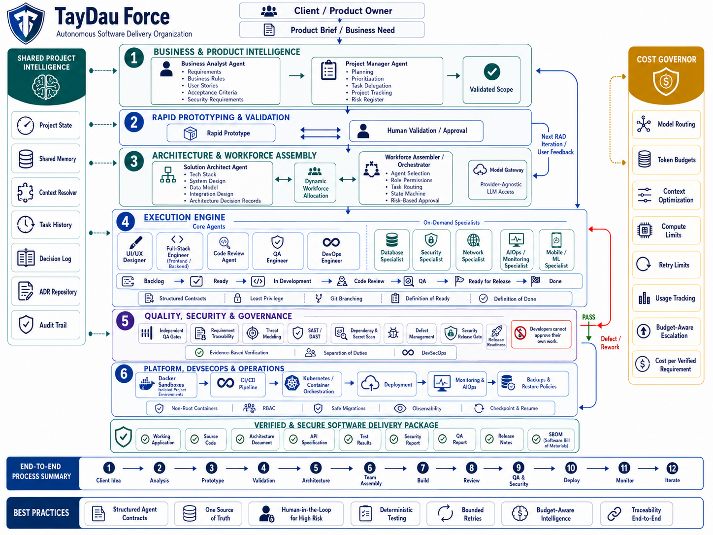

<p align="center">
  
</p>

<h1 align="center">TayDau Force</h1>

<p align="center">
  <strong>Autonomous Software Delivery Organization</strong><br>
  <em>Turn a product brief into planned, developed, independently verified and security-aware software through a governed AI workforce.</em>
</p>

<p align="center">
  <a href="https://taydau-force.vercel.app" target="_blank">
    
  </a>
</p>

---

TayDau Force is an autonomous software delivery organization designed to coordinate specialized AI roles across the software development lifecycle.

This repository currently contains the interactive concept prototype created for the **Alibaba Cloud AI Hackathon Pakistan 2026**.

> **Status:** Interactive Concept Prototype  
> The current version uses simulated project data and workflow states. Live AI agent orchestration, Docker-based execution, model calls, and DevSecOps automation are planned for the next implementation stage.

## 🌐 Live Demo

🔗 **Official Deployment:** [https://taydau-force.vercel.app](https://taydau-force.vercel.app)

---

## Architecture Diagram



---

## Problem

Modern AI coding tools can generate applications quickly, but software delivery still requires structured requirements, planning, architecture, development, independent testing, security checks, deployment, and project-level accountability.

TayDau Force focuses on that complete delivery process.

## Proposed Solution

A user provides a product idea or business requirement.

TayDau Force then manages a structured workflow:

Client Idea  
→ Business Analysis  
→ Planning  
→ Architecture  
→ Dynamic AI Team Assembly  
→ Development  
→ Code Review  
→ QA and Security  
→ Rework if required  
→ Verified Build  
→ Deployment  
→ Monitoring  
→ Next Iteration

The system is designed around specialized AI roles, shared project state, independent verification, security controls, and budget-aware model usage.

## Current Prototype

The current prototype demonstrates the planned TayDau Force workflow using static client-side mock data.

Included modules:

- **Overview Dashboard**: Executive KPIs, 12-stage lifecycle track, active workforce, demo activity feed.
- **Project and Business Analysis**: Original client brief, actors, functional scope, 4 business rules, risks, assumptions, 3-warehouse topology.
- **Requirements and Traceability**: 10 core requirements matrix with interactive right-side traceability detail drawer (ACs, tasks, code files, tests, QA and Security attestations).
- **System Architecture**: 8-stage visual pipeline cards, selected tech stack strip, side panels (Shared Project Intelligence & Cost Governor), and Architecture Decision Records (ADR-001..004).
- **Dynamic AI Workforce**: 7 Core Team roles, 6 On-Demand Specialists (Activated vs Not Required vs Planned), dynamic assembly rationale, and explicit Agent Permissions matrix (Can / Cannot rules).
- **Execution Kanban Board**: 7 workflow lanes (Backlog, Ready, In Development, Code Review, QA, Ready for Release, Done), task inspector drawer, and simulated agent activity stream.
- **QA and Security Review**: Quality metrics (42 unit / 17 integration / 9 E2E), requirement coverage, policy card (*"Developers cannot approve their own work"*), QA orchestration flow, 6 automated security checks, SEC-001 finding, and release gate.
- **Defect Management**: Defect register tracking DEF-01 through DEF-04 with auto-triage to Full-Stack Engineer and UI/UX Designer.
- **Cost Governor**: Real-time spend tracking ($1.84 used / $5.00 limit), agent cost breakdown, model routing examples, 7 enforcement policies, and Cost per Verified Requirement KPI ($0.17).
- **Delivery and Release Readiness**: 11-item software delivery manifest, release gate rationale, interactive Zero-Trust Verification Evidence Register modal, and complete 12-stage organizational lifecycle.

## Demo Project

The prototype uses the following sample project:

### Smart Inventory Management System

The system is designed for a company operating three warehouses (Austin Central, Chicago North Hub, Houston Port Terminal).

The sample requirements include:

- `REQ-001` User authentication
- `REQ-002` Role-based access (RBAC)
- `REQ-003` Product catalog management
- `REQ-004` Warehouse management
- `REQ-005` Stock receiving
- `REQ-006` Stock transfers (Multi-warehouse atomic concurrency)
- `REQ-007` Low-stock threshold alerts
- `REQ-008` Inventory dashboard
- `REQ-009` FIFO valuation reports
- `REQ-010` Cryptographic audit history

## Interactive Simulation

The prototype includes a controlled workflow simulation.

Example sequence:

1. Full-Stack Engineer completes a task (`TASK-12 Stock Transfer API`)
2. Task moves to QA
3. QA executes concurrency test (`TEST-23`)
4. Test fails (race condition over-allocation detected)
5. QA rejects the task
6. Defect `DEF-03` is created automatically
7. Project Manager reassigns the work
8. Engineer applies simulated fix (Pessimistic `SELECT FOR UPDATE` lock)
9. QA retests concurrency suite (100 parallel threads)
10. Test passes
11. Requirement `REQ-006` becomes verified

This simulation demonstrates the planned orchestration model. It does not currently invoke live AI agents.

## Core Architecture

TayDau Force is designed as a layered autonomous software delivery system.

### 1. Business and Product Intelligence

Includes:
- Business Analyst Agent
- Project Manager Agent
- Requirements, business rules, user stories, acceptance criteria, security requirements

### 2. Rapid Prototyping and Validation

Includes:
- Rapid prototype
- Client validation
- User feedback
- Iterative refinement

### 3. Architecture and Workforce Assembly

Includes:
- Solution Architect Agent
- Technical architecture, data model, integration design
- Architecture Decision Records (ADRs)
- Dynamic workforce allocation, agent permissions, task routing

### 4. Execution Engine

Core roles:
- UI/UX Designer
- Full-Stack Engineer
- Code Review Agent
- QA Engineer
- DevOps Engineer

On-demand specialists:
- Database Specialist (Activated)
- Security Specialist (Activated)
- Network Specialist (Not Required)
- AIOps and Monitoring Specialist (Planned)
- Mobile or ML Specialist (Not Required)

### 5. Quality, Security and Governance

Includes:
- Independent QA verification
- Requirement traceability
- Threat modelling, SAST, DAST, dependency scanning, secret scanning
- Defect management and security release checks

A core policy is:
> **Developers cannot approve their own work.**

### 6. Platform, DevSecOps and Operations

Planned implementation:
- Docker sandboxes
- Git-based version control
- GitHub Actions CI/CD
- Kubernetes for scale-out orchestration
- Alibaba Cloud ACK deployment
- Monitoring, backup, and disaster recovery policies

## Shared Project Intelligence

All agents work from shared project state:
- Unified requirement & task state graph
- Cross-agent semantic memory
- Context resolver with AST prompt pruning
- Commit and test execution lineage
- Architecture decision records
- Cryptographic audit trail

This prevents agents from maintaining separate and conflicting interpretations of the project.

## Cost Governor

TayDau Force treats AI cost as a first-class engineering constraint:
- Tiered task-to-model routing (Fast / Low Cost vs Coding vs Reasoning)
- Hard project token budgets ($5.00 limit)
- Dynamic context optimization (AST pruning under 4k tokens)
- Standard retry limits (max 2 attempts before escalation)
- Budget-aware escalation to higher reasoning tiers
- Unit economics: **Cost per Verified Requirement ($0.17)**

## Security Approach

TayDau Force does not assume AI-generated software is secure:
- Security requirements and threat modelling
- Least-privilege permissions and sandbox isolation
- Dependency, secret, and SAST scanning
- Role-Based Access Control (RBAC) authorization validation
- Security findings tracked as release-blocking defects (`SEC-001`)
- Post-deployment telemetry and audit logging

## How TayDau Force Differs

TayDau Force is not just an AI coding interface — it is a complete governed software delivery organization:
- **Project-Level Orchestration**: Coordinates specialized roles from brief to release.
- **Dynamic AI Workforce Assembly**: Activates specialists only when triggered by specifications.
- **Shared Project State**: Single source of truth across all autonomous roles.
- **Traceability**: Direct lineage from client brief &rarr; acceptance criteria &rarr; code commits &rarr; test assertions &rarr; release gate.
- **Separation of Implementation and Verification**: Independent QA agents validate code against acceptance criteria.
- **Integrated DevSecOps**: Zero-trust security gates before release sign-off.
- **Cost-Aware Routing**: Tiered models prevent budget blowouts.
- **Evidence-Based Delivery**: Release decisions backed by verifiable test and security artifacts.

## Technology Stack

**Current Prototype:**
- React 18
- TypeScript
- Vite
- Tailwind CSS
- React Router v6
- Lucide React
- Local mock state engine

**Planned Implementation:**
- Alibaba Cloud AI / Qwen 2.5 models
- Model Gateway & Context Resolver
- Autonomous Agent Orchestration Service
- PostgreSQL & Redis (Shared Project Graph)
- Docker & Kubernetes (ACK)
- GitHub Actions CI/CD
- Semgrep & Trivy (DevSecOps scanners)
- Alibaba Cloud OSS & ECS/ACK hosting

## Run Locally

Clone the repository:

```bash
git clone https://github.com/programmerpakistaniorg/taydau-force.git
cd taydau-force
```

Install dependencies:

```bash
npm install
```

Run the development server:

```bash
npm run dev
```

Open:

```text
http://localhost:5173
```

Build the production version:

```bash
npm run build
```

Preview the production build:

```bash
npm run preview
```

## Project Structure

```text
src/
├── components/
│   ├── common/             # Badges, Cards, Modals, Drawers, StatusPills
│   └── layout/             # Header, Sidebar, AppLayout, Footer
├── context/
│   └── SimulationContext.tsx # 11-step interactive simulation state machine
├── data/
│   └── mockData.ts         # BA brief, 10 reqs, tasks, ADRs, agents, defects
├── pages/
│   ├── Overview.tsx        # Hero landing, 4 capability cards, KPIs, lifecycle
│   ├── Project.tsx         # Business Analyst output, actors, rules, risks
│   ├── Requirements.tsx    # 10 reqs matrix + Traceability Detail Drawer
│   ├── Architecture.tsx    # Pipeline flow, tech stack, ADR-001..004
│   ├── Workforce.tsx       # 7 Core + 6 Specialists + Agent Permissions
│   ├── Execution.tsx       # 7-Lane Kanban, task inspector, simulated activity
│   ├── QASecurity.tsx      # Quality tests, SEC-001 finding, release readiness
│   ├── CostGovernor.tsx    # Budget metrics, model routing, $0.17/req KPI
│   └── Delivery.tsx        # 11-item manifest, blocked gate, evidence modal
├── types/
│   └── index.ts            # Complete TypeScript domain interfaces
├── App.tsx                 # Route mapping (BrowserRouter)
├── index.css               # Design system tokens and styling
└── main.tsx                # React entry point
```

## Current Status

**Completed:**
* System Requirements Specification (SRS) & Architecture Design
* Agent role definition & permissions model
* 12-stage autonomous software delivery lifecycle
* Security & DevSecOps governance model
* Cost governor & tiered model routing design
* Interactive concept prototype
* 11-step interactive simulation engine
* Requirement-to-test traceability interface
* Independent QA & security gate interface
* Verified software delivery package manifest

**Next Implementation Stage:**
* Connect live Alibaba Cloud Qwen / AI Foundry models
* Persistent shared project graph (PostgreSQL/Vector DB)
* Docker container execution sandboxes
* Git repository integration with automated pull requests
* Real-time PyTest & Playwright test execution
* Automated SAST & dependency vulnerability scanning
* Live token expenditure telemetry
* Deployed end-to-end generated application on Alibaba Cloud ACK

---

## Hackathon

TayDau Force is being developed for:

**Alibaba Cloud AI Hackathon Pakistan 2026**
