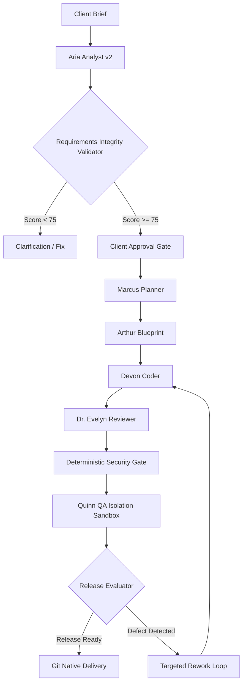
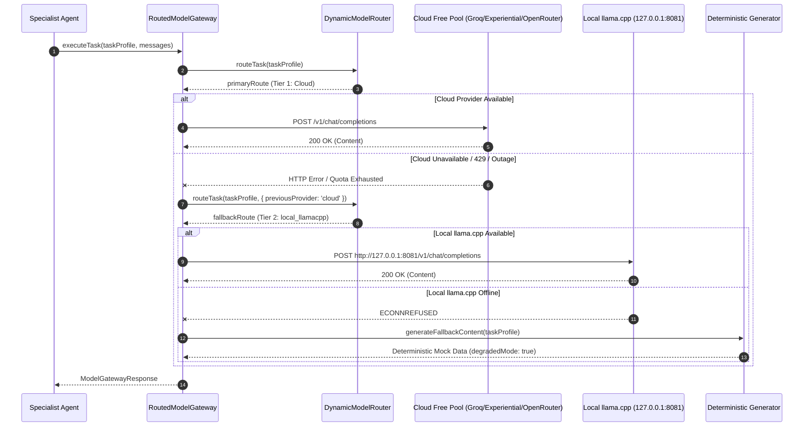

# TAYDAU FORCE — RUNTIME EXECUTION FLOWS

**Status:** ACTIVE GOVERNANCE CONTRACT  
**Scope:** Canonical runtime call sequences, failover chains, and event progressions across the TayDau Force organization.

---

## Flow Index

1. **`FLOW-ORCH-001`**: End-to-End Vertical Delivery Slice
2. **`FLOW-ROUT-001`**: Three-Tier Dynamic Model Routing & Failover
3. **`FLOW-ARIA-001`**: Business Analysis & Requirements Integrity Gate
4. **`FLOW-EXEC-001`**: Engineering Execution, Review, and Isolated QA

---

## Detailed Runtime Flow Specifications

### FLOW-ORCH-001: End-to-End Vertical Delivery Slice

- **Entry Point:** `POST /api/projects/:id/pipeline` (or Interactive UI Workflow).
- **Primary Services:** `OrchestratorService`, `AriaAgent`, `MarcusAgent`, `ArthurAgent`, `DevonAgent`, `EvelynAgent`, `QuinnAgent`.
- **Database Tables:** `projects`, `requirements`, `tasks`, `code_files`, `qa_suites`, `pipeline_events`.
- **Durable Events:** `brief.submitted`, `requirements.synthesized`, `requirements.validated`, `plan.approved`, `code.generated`, `review.completed`, `qa.evaluated`, `release.approved`.
- **Failure Path:** If any gate fails (Integrity score $<75$, Security vulnerability, QA assertion failure), the pipeline transitions to `REWORK_IN_PROGRESS` or `BLOCKED_AWAITING_INPUT`.

---

### FLOW-ROUT-001: Three-Tier Dynamic Model Routing & Failover

- **Entry Point:** `RoutedModelGateway.executeTask()`.
- **Services:** `DynamicModelRouter`, `ProviderHealthTracker`, `ProviderRegistry`, `CostTelemetryService`.
- **Database Tables:** `llm_calls`, `model_routing_decisions`.
- **External Providers:** Groq (`openai/gpt-oss-120b`), Experiential (`qwen3.8-27b`), Local llama.cpp (`local/qwen3.5-9b`).
- **Telemetry Contract:** Telemetry logging runs non-blocking (`.catch(() => {})`) to ensure database downtime never disrupts inference failover.

---

### FLOW-ARIA-001: Business Analysis & Requirements Integrity Gate
- **Entry Point:** `runBAAgent(gateway, brief, projectId)`.
- **Call Sequence:**
  1. Construct context-isolated prompt (Zero Cross-Domain Canaries).
  2. Invoke `RoutedModelGateway` with `BARequirementsOutputSchema`.
  3. Run `parseAndValidate` with multi-token brace extractor recovery.
  4. Pass parsed requirements to `RequirementsIntegrityValidator.validate(projectId, brief, output)`.
  5. Compute 5-Pillar Score:
     - Specificity Floor ($\ge 12$ words per criterion).
     - Testability (Given/When/Then or measurable assertions).
     - Scope Boundary (Explicit in-scope and out-of-scope).
     - Domain Consistency (0 canary contamination).
     - Provenance Completeness (100% requirements linked to `projectId`).
- **Exit State:**
  - If Score $\ge 75$: Emit `requirements.synthesized` with `status: PENDING_APPROVAL`.
  - If Score $< 75$: Emit `requirements.failed_validation`, return blocking diagnostic report.

---

### FLOW-EXEC-001: Engineering Execution, Review, and Isolated QA
- **Entry Point:** `executeTask(task, architectureBlueprint)`.
- **Key Constraints:**
  1. `Devon Coder` generates implementation code adhering strictly to `Arthur Blueprint` schema contracts.
  2. `Dr. Evelyn Reviewer` independently reviews code against acceptance criteria.
  3. `Deterministic Security Gate` scans AST for hardcoded secrets, injection vectors, and prototype pollution.
  4. `Quinn QA Tester` generates test assertions in isolated sandbox without code tampering.
  5. `Release Evaluator` checks:
     - 100% QA tests passing.
     - Reviewer approved.
     - Security Gate passed.
     - `degradedMode == false` (if deterministic generator was used, Release Ready is strictly blocked).
