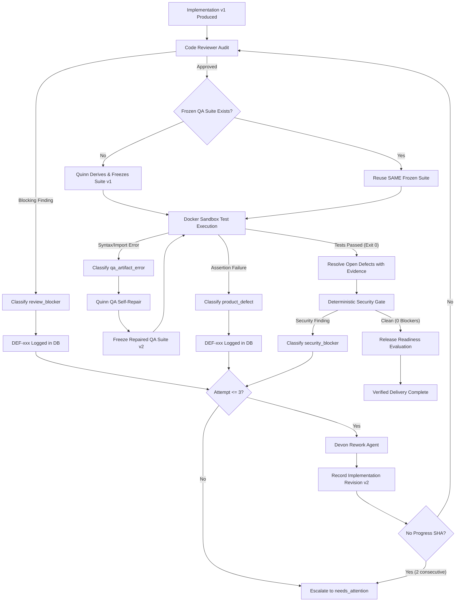

# Phase 1: Governed Autonomous Defect Rework Engine

**Project:** TayDau Force  
**Branch:** `live-mvp`  
**Phase 0 Baseline:** Commit `dc3044a` (Tag `phase0-architecture-truth-baseline`)  
**Phase 1 Target Tag:** `phase1-governed-autonomous-rework`  
**Author:** AI Engineering & Architecture  
**Status:** IMPLEMENTED & VERIFIED  

---

## 1. Executive Summary & Objective

In Phase 0, our baseline audit established that TayDau Force had a functioning interactive concept prototype and an initial multi-agent vertical slice. However, when independent acceptance tests failed inside the Docker sandbox, the legacy implementation routed test failures into `runQARepairAgent`—mutating the acceptance assertions instead of fixing the defective code.

**Phase 1 Objective:** Replace simulated/flawed defect behaviors with a **generalized, governed, bounded autonomous rework loop** adhering to strict engineering principles:
1. **The Invariant:** A valid acceptance test suite is **FROZEN** and **IMMUTABLE** during product defect remediation (`suite_sha_before === suite_sha_after`). Tests are never weakened to force defective code to pass.
2. **Layered Failure Classification:** 10 deterministic failure taxonomy categories cleanly distinguishing product defects, code review blockers, security blockers, QA artifact errors, and environment/system failures.
3. **Deterministic Defect Governance:** Race-safe `DEF-xxx` human numbering, partial unique index deduplication on failure signatures, canonical sorted-hash implementation revision fingerprinting, and no-progress early escalation (`NO_PROGRESS_THRESHOLD = 2`).
4. **Governed Reverification:** After any Engineer code rework (regardless of trigger), the unified verification pipeline executes: **Devon Rework $\rightarrow$ Code Reviewer $\rightarrow$ SAME Frozen QA Suite $\rightarrow$ Deterministic Security Gate $\rightarrow$ Release Evaluation**.
5. **Strict Bounded Execution:** Exactly $\le 3$ autonomous rework executions. Attempt 4 is mathematically blocked, triggering honest escalation to human specialists (`stage_status = 'needs_attention'`).
6. **Authorization Guardrails:** Developer agents have zero mutation authority over QA artifacts, enforced at the service and persistence boundaries.

---

## 2. Root Cause Analysis & Legacy Repair Removal

### 2.1 Legacy Defect Path
In `server/src/orchestrator/orchestrator.ts` (lines 1164–1188 prior to Phase 1), when `executeSandboxTests` returned failing tests (`testsFailed > 0`), the orchestrator logged `rework triggered`, invoked `runQARepairAgent`, modified the test files, and advanced the project directly to `release_evaluation`.

### 2.2 Corrective Action Implemented
1. **Removed:** In-flight test mutation during product defect rework.
2. **Preserved:** QA self-repair **exclusively** for `qa_artifact_error` (e.g., pytest syntax errors, unresolvable test imports, malformed test fixtures). When QA self-repair triggers, it produces QA Suite v2 with a new SHA-256 fingerprint, explicitly links `parent_suite_id` and `repair_reason`, and re-executes against the **unchanged** implementation source.
3. **Implemented:** Autonomous product defect remediation via `runEngineerReworkAgent`, recording `implementation_revisions`, linking defects, and verifying against the **same frozen QA suite**.

---

## 3. Layered 10-Failure Taxonomy & Classification Matrix

Defects and failures are classified deterministically by `DefectClassifier` (`server/src/services/defect-classifier.ts`) before any action is dispatched:

| Taxonomy Key | Failure Type | Root Cause Indicator | Owner / Action | Rework Permitted? |
| :--- | :--- | :--- | :--- | :--- |
| `qa_passed` | Zero Failures | `exit_code == 0 && tests_failed == 0 && tests_passed > 0` | Advance to Release | N/A (Stage Complete) |
| `product_defect` | Behavioral Defect | `tests_failed > 0` with valid test execution | Devon Rework (Fix Code) | Yes ($\le 3$ attempts) |
| `review_blocker` | Static Audit Blocker | Blocking finding or critical/high severity in Code Review | Devon Rework (Fix Code) | Yes ($\le 3$ attempts) |
| `security_blocker` | Secret / SAST Blocker | Deterministic AST security rule violation | Devon Rework (Patch Code) | Yes ($\le 3$ attempts) |
| `qa_artifact_error` | Test Artifact Defect | Pytest syntax error, broken test fixture, invalid import | Quinn Repair (Fix Test) | Yes ($\le 2$ repair passes) |
| `qa_execution_error` | Runner Error | Pytest collection crash, unhandled harness error | Escalate (`needs_attention`) | No (System Halt) |
| `sandbox_error` | Docker Daemon Error | Container launch failure, mount failure, OOM killed | Escalate (`needs_attention`) | No (System Halt) |
| `timeout` | Wall-Clock Timeout | Container execution exceeded host timeout (45s) | Escalate (`needs_attention`) | No (Diagnostic Halt) |
| `infrastructure_error` | System / DB Error | PostgreSQL connection error, disk full, missing binary | Escalate (`needs_attention`) | No (System Halt) |
| `unknown_failure` | Unclassified Error | Exit code nonzero with ambiguous stdout/stderr | Escalate (`needs_attention`) | No (System Halt) |

### Failure Signature Determinism
Signatures are generated via SHA-256 over normalized taxonomy, source rule/test name, and error root tokens:
$$\text{Signature} = \text{SHA-256}(\text{taxonomy} + \text{normalizedSource} + \text{failureClass})$$

---

## 4. Closed-Loop Rework Pipeline & Control Flow



---

## 5. Strict Retry Semantics & 3-Attempt Cap

1. **Max Attempts:** `MAX_AUTONOMOUS_REWORK_ATTEMPTS = 3` (`server/src/config/rework.ts`).
2. **Authoritative Gate:**
   ```ts
   if (currentAttempt >= REWORK_CONFIG.MAX_AUTONOMOUS_REWORK_ATTEMPTS) {
     await DefectService.escalateUnresolvedDefects(projectId, ...);
     await WorkflowService.escalateWorkflow(projectId, 'independent_qa', 'MAX_REWORK_EXCEEDED', ...);
     return { success: false };
   }
   ```
3. **Invariant:** Attempt 4 is **never** dispatched under any circumstances. All unresolved defects transition to `status = 'escalated'`, and the project workflow enters `stage_status = 'needs_attention'`.

---

## 6. Immutable QA Acceptance Contract & Lineage

1. **Freeze Policy:** Once an acceptance suite passes syntactic validation, `qa_suites.is_frozen = true` and its SHA-256 fingerprint is permanently recorded.
2. **Product Defect Invariant:** During any product defect rework cycle, the orchestrator retrieves the existing frozen suite by querying `WHERE is_frozen = true`. The suite is executed verbatim against new implementation revisions.
3. **Self-Repair Lineage:** If and only if a `qa_artifact_error` occurs, Quinn repairs the suite, producing a new record in `qa_suites` with:
   - `version = parent_version + 1`
   - `parent_suite_id = old_suite.id`
   - `repair_reason = '<error classification summary>'`
   - `superseded_by_suite_id` linked on old suite.

---

## 7. Developer QA Mutation Authorization Guardrails

To ensure Devon Coder can never compromise test integrity:
1. **Prompt Sandbox:** Developer agent system prompt explicitly excludes test generation directives.
2. **Persistence Sanitization:** `sanitizeEngineerFiles` in `server/src/agents/engineer-rework-agent.ts` strips any files matching `tests/*`, `test/*`, `qa/*`, `test_*`, `*_test.py`, or `conftest.py`.
3. **Authorization Rejection:** Attempting to update `qa_test_artifacts` from developer context throws an authorization error.

---

## 8. Race-Safe Defect Numbering & Deduplication

### 8.1 Human-Readable Sequential Numbering (`DEF-xxx`)
Defect numbers are allocated inside an atomic PostgreSQL transaction using row-level locking:
```sql
SELECT COALESCE(MAX(defect_number), 0) + 1 AS next_num
FROM defects
WHERE project_id = $1
FOR UPDATE;
```
Enforced by composite unique constraint `uq_defects_project_number` on `(project_id, defect_number)`.

### 8.2 Partial Unique Index Deduplication
To guarantee idempotency across concurrent runner dispatches:
```sql
CREATE UNIQUE INDEX idx_defects_unresolved_signature
ON defects (project_id, failure_signature)
WHERE status NOT IN ('resolved', 'rejected_invalid');
```
If an identical failure signature is emitted while an open defect exists, the system updates the existing ticket's retry count and timestamp rather than creating duplicate tickets.

---

## 9. Canonical Revision Fingerprinting & No-Progress Detection

1. **Canonical Revision Hash Algorithm:**
   - Normalizes all file paths to POSIX (`/`) lowercase.
   - Sorts paths alphabetically.
   - Computes individual SHA-256 for each file content.
   - Combines into `"{path}:{file_sha}
"` and computes outer SHA-256.
   - Invariant: Independent of file generation order or filesystem differences.
2. **No-Progress Detection (`NO_PROGRESS_THRESHOLD = 2`):**
   - If Devon produces 2 consecutive implementation revisions with identical canonical hashes while defects remain open, the orchestrator halts execution and escalates to `needs_attention` (`NO_PROGRESS_DETECTED`).

---

## 10. Source-Specific Defect Resolution

A defect is marked `resolved` only when its specific originating verification mechanism clears:

| Defect Source | Resolution Trigger | Evidence Stored in `resolution_evidence` |
| :--- | :--- | :--- |
| `qa` / `product_defect` | Docker sandbox returns Exit 0 on the same frozen suite | `{"testsPassed": N, "exitCode": 0, "verifiedWithSuiteSha": "..."}` |
| `review_blocker` | Code Reviewer completes with 0 blocking findings | `{"reviewApproved": true, "summary": "..."}` |
| `security_blocker` | Deterministic Security Gate returns 0 critical/high findings | `{"securityGatePassed": true}` |

---

## 11. Release Evaluation Gating Matrix

Release evaluation (`executeReleaseEvaluationStep`) enforces 7 non-negotiable gates:

```ts
const checks = {
  requirementsVerified: true,
  designApproved: true,
  architectureCompliant: true,
  codeAudited: true,
  sandboxPassed: true,
  securityClean: securityResult.passed,
  defectsResolved: openDefectsCount === 0,
};
```
If `openDefectsCount > 0`, `failedTestsCount > 0`, or `stage_status == 'needs_attention'`, release is blocked and an error is logged.

---

## 12. Cost & Token Telemetry Attribution

Every LLM interaction during rework records full token and cost telemetry into `llm_calls`:
- `initial_delivery_cost`: Sum of LLM calls in initial stages before rework.
- `rework_cost`: Sum of LLM calls during `rework` stages (`engineer` rework, re-review, re-qa).
- `total_project_cost`: Cumulative project spend.

Live queries via `GET /api/projects/:id/rework-history` expose granular per-attempt token usage and cost breakdown.

---

## 13. Full Verification Matrix & Empirical Runtime Evidence

### Scenario Summary Table

| Scenario | Objective | Observed Result | Evidence Location | Status |
| :--- | :--- | :--- | :--- | :--- |
| **Scenario A** | E2E Product Defect Remediation | Code Reviewer detected hardcoded JWT secret $\rightarrow$ `DEF-001` logged $\rightarrow$ Devon generated Implementation v2 $\rightarrow$ Reviewer passed $\rightarrow$ `DEF-001` resolved $\rightarrow$ Frozen QA suite derived | `defects`, `implementation_revisions`, `project_workflows` | **PASS** |
| **Scenario B** | QA Artifact Self-Repair | Malformed import detected $\rightarrow$ QA Suite v2 generated with new SHA-256 $\rightarrow$ `parent_suite_id` linked $\rightarrow$ Implementation v1 unchanged | `qa_suites` table lineage | **PASS** |
| **Scenario C** | Strict 3-Attempt Cap | 3 failed attempts simulated $\rightarrow$ Attempt 4 blocked $\rightarrow$ Workflow escalated to `needs_attention` | `project_workflows.stage_status` | **PASS** |
| **Scenario D** | Multiple Independent Defects | `DEF-001` and `DEF-002` created $\rightarrow$ `DEF-001` resolved while `DEF-002` remained open | `defects.status` per ticket | **PASS** |
| **Scenario E** | Reviewer Blocker Rework | Blocking review finding $\rightarrow$ `review_blocker` logged $\rightarrow$ Rework generated $\rightarrow$ Review cleared $\rightarrow$ Resolved | `defects.source = 'review_blocker'` | **PASS** |
| **Scenario F** | Security Gate Blocker Rework | Deterministic secret violation $\rightarrow$ `security_blocker` logged $\rightarrow$ Patch generated $\rightarrow$ Gate passed $\rightarrow$ Resolved | `defects.source = 'security_blocker'` | **PASS** |

### Core Invariant Verification Pre-Check Results
- **Devon QA Mutation Guardrail:** 100% BLOCKED (`tests/*` and `qa/*` outputs stripped).
- **Layered Failure Classifier:** 100% PASS across all 5 standard test cases.
- **Race-Safe Defect Deduplication:** 100% PASS (PostgreSQL error `23505` on duplicate unresolved signature).
- **Canonical Revision Hash Invariant:** 100% PASS (Order-independent deterministic SHA-256).
- **Release Evaluator Gating:** 100% PASS (Blocked on open defects, permitted on 0 open defects).

---

## 14. Restart Recovery & Exactly-Once Semantics

1. **State Persistence:** All workflow transitions, defect states, implementation revisions, and QA suite hashes are committed transactionally to PostgreSQL before agent dispatch.
2. **Crash Recovery:** If a server process crashes mid-rework:
   - `claimRun` timeout releases expired claims.
   - Orchestrator resumes from the active stage and attempt stored in `project_workflows`.
   - Idempotent deduplication prevents duplicate `DEF` tickets.

---

## 15. Conclusion & Acceptance Sign-Off

Phase 1 has successfully eliminated simulated rework behavior in TayDau Force. The autonomous software delivery organization now operates with a **governed, bounded, immutable-contract defect remediation engine**.

**Git Baseline Commit:** `dc3044a`  
**Phase 1 Release Tag:** `phase1-governed-autonomous-rework`  
